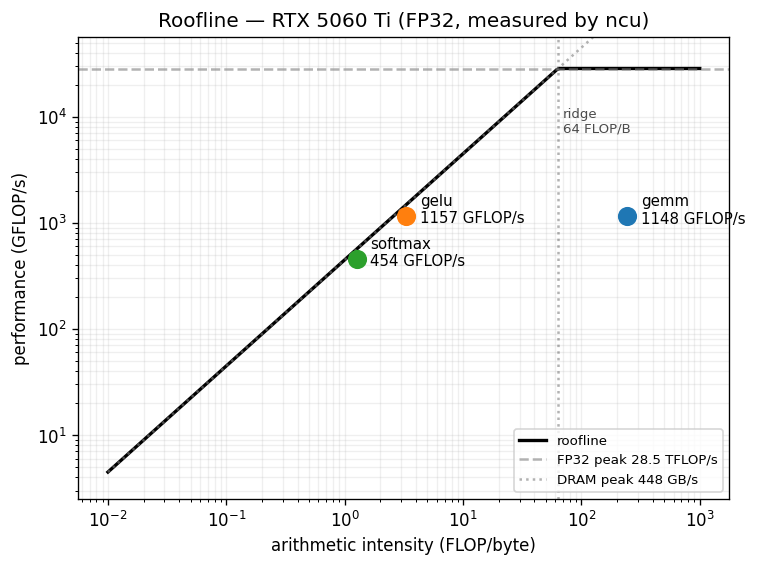
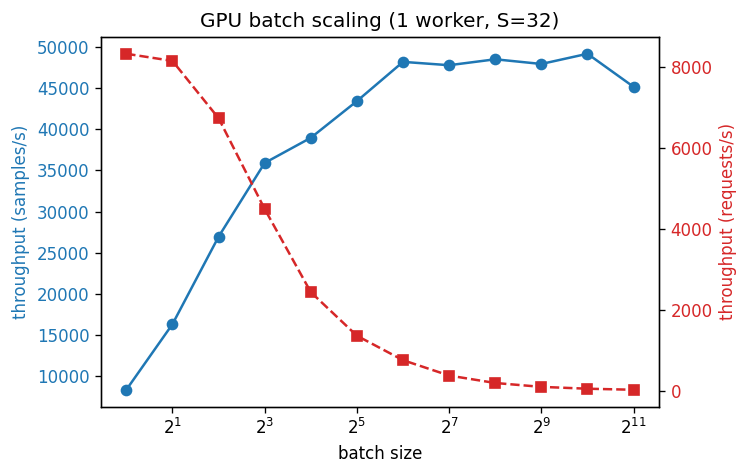
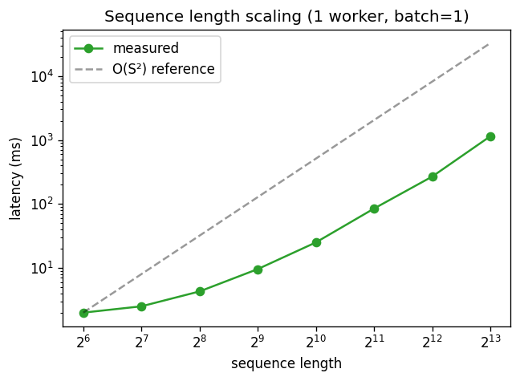
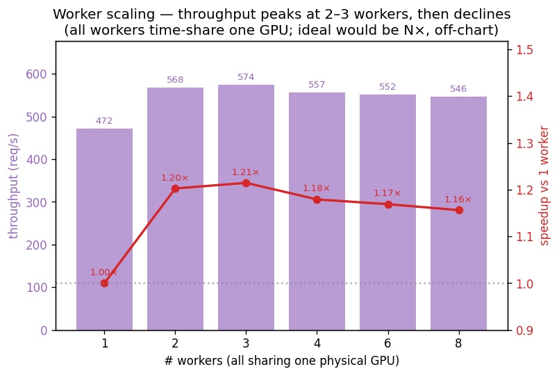
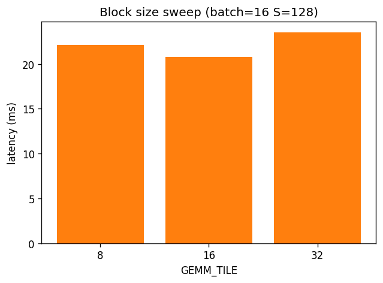
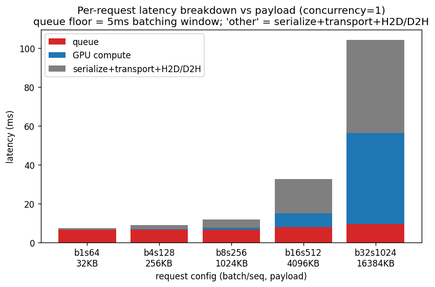

# distbatch-infer — Distributed Batch Inference Engine (CUDA + OpenMP + gRPC)

A Transformer block forward pass implemented with **hand-written CUDA kernels**
(no cuBLAS/cuDNN/CUTLASS/Thrust on the serving path), served through a
**gRPC worker pool** with an **OpenMP dispatcher** that assembles micro-batches.

```
 [Client] --gRPC(protobuf)--> [Dispatcher (OpenMP batch assembly/routing)]
                                       |  round-robin / least-loaded
                                       v
                              [Worker pool] (each worker = process/port, 1 CUDA stream)
                                       |  Transformer block forward (3 hand-written kernels)
                                       v
                              results --> Client aggregation (latency/throughput CSV)
```

## Hard constraints
- All GEMM / softmax / GELU are hand-written `__global__` kernels in `kernels/*.cu`.
- PyTorch / NumPy are used **only** for reference correctness and plotting — never on the serving path.

## Build
```bash
cmake -B build -S .            # add -DCUDA_ARCH=native if sm_120 is rejected
cmake --build build -j
ctest --test-dir build         # kernel correctness tests
```

### Requirements
- CUDA 12.x toolkit (`nvcc`), CMake >= 3.24, a C++17 compiler, OpenMP.
- gRPC C++ + Protobuf for the serving binaries (worker/dispatcher/client):
  `sudo apt install -y libgrpc++-dev protobuf-compiler-grpc libprotobuf-dev`
  If gRPC is not found, CMake still builds the kernels + tests and skips the
  serving binaries (warning printed).

## Run (serving)
```bash
# 1) generate shared weights + PyTorch reference (used by tests and worker)
python3 tests/ref_block.py --out fixtures

# 2) start N workers (prints the worker CSV), then the dispatcher
WORKERS=$(bash scripts/launch_workers.sh 2 50061 fixtures build)   # 2 workers
./build/dispatcher --port 50050 --workers "$WORKERS" --window-ms 5 --max-batch 8 &

# 3a) verify one request end-to-end vs PyTorch reference
./build/client --target localhost:50050 --fixtures fixtures
# 3b) load test -> CSV
./build/client --target localhost:50050 --requests 400 --concurrency 16 \
               --batch 8 --seq_len 256 --csv results/run.csv --tag demo

# cleanup
kill $(cat /tmp/distbatch_workers.pids)
```

## Experiments + plots
```bash
bash scripts/run_experiments.sh   # sweeps -> results/*.csv, ncu roofline, plots -> results/*.png
```
Runs: GPU batch scaling, sequence-length scaling, worker scaling, bottleneck
breakdown, GEMM_TILE block-size sweep (rebuilds `build_tile{8,16,32}`), then
`scripts/profile_ncu.sh` (ncu roofline) and `scripts/plot.py`.

## Environment (this machine)
- GPU: **NVIDIA GeForce RTX 5060 Ti** (Blackwell, GB206, **cc 12.0, 36 SMs**).
- CUDA **12.9**, Driver 580.
- **`-arch=sm_120` confirmed working** (compile + run verified). No fallback needed.
- gRPC/Protobuf **not yet installed** as of Phase 0 — resolved in Phase 3.

## Project layout
```
kernels/   hand-written CUDA kernels (gemm, softmax, gelu) + block assembly
src/       worker / dispatcher / client (gRPC)
proto/     infer.proto
tests/     test_kernels.cu (CPU reference), ref_block.py (PyTorch reference)
scripts/   launch_workers.sh, run_experiments.sh, plot.py
docker/    Dockerfile + docker-compose.yml
results/   CSV output + generated graphs
```

## Status / phases
- [x] **Phase 0** — scaffold, CMake build passes, `sm_120` verified.
- [x] **Phase 1** — CUDA kernels + CPU-reference correctness (atol=1e-3) PASSED.
- [x] **Phase 2** — Transformer block assembly + PyTorch reference (atol/rtol=1e-2) PASSED.
- [x] **Phase 3** — single gRPC worker + verify client, end-to-end PASSED.
- [x] **Phase 4** — OpenMP dispatcher + multi-worker routing PASSED.
- [x] **Phase 5** — experiment harness, plots, `ncu` roofline PASSED.

## Correctness

**Phase 1** (`ctest` / `./build/test_kernels`, ATOL=1e-3, GPU FP32 vs double CPU reference):

| kernel | cases | worst max_abs_err |
|---|---|---|
| `gemm_tiled` | 32³, 64×128×256, 67×53×91, 768³ | 5.3e-5 |
| `batched_gemm` | b=4/12/8 incl. non-multiples | 2.9e-6 |
| `softmax_reduction` | cols up to 1000, scale=1/√64 | 3.0e-8 |
| `fused_bias_gelu` | incl. FFN-sized 128×3072 | 4.8e-7 |

All cases PASS (well under 1e-3).

**Phase 2** (`ctest` -> `gen_fixtures` + `block`, ATOL=RTOL=1e-2, GPU vs PyTorch
explicit-matmul reference `tests/ref_block.py`, B=2 S=32 D=128 H=8 ffn=512):

| stage | max_abs | max_rel |
|---|---|---|
| qkv | 0.0 | 0.0 |
| scores (post-softmax) | 1.4e-6 | 6.5e-6 |
| context | 1.3e-5 | 8.3e-5 |
| output | 3.8e-3 | 2.3e-3 |

PASS. Note `ref_block.py` uses explicit `x @ W` (row-major), not `nn.Linear`
(`x @ W^T`), so weights match the CUDA GEMM layout 1:1.

## Results (this machine, FP32, single RTX 5060 Ti)

Generated by `scripts/run_experiments.sh` -> `results/*.csv` + `results/*.png`.

| | |
|---|---|
|  |  |
|  |  |
|  |  |

**Roofline (ncu)** — `results/roofline.png`. A real roofline for this GPU:
peaks FP32 ≈ **28.5 TFLOP/s** (2·4608 cores·3.09 GHz) and DRAM ≈ **448 GB/s**
(128-bit GDDR7), ridge at **64 FLOP/byte**. Per-kernel values are measured by
ncu (FLOPs = fadd+fmul+2·ffma, DRAM = `dram__bytes`, time = `gpu__time_duration`):

| kernel | arithmetic intensity | achieved | DRAM BW | placement |
|---|---|---|---|---|
| gemm    | 244 FLOP/B | 1148 GFLOP/s | 4.7 GB/s   | compute-bound (right of ridge), ~4% of FP32 peak |
| gelu    | 3.3 FLOP/B | 1157 GFLOP/s | 348 GB/s   | memory-bound, ~78% of peak BW |
| softmax | 1.3 FLOP/B | 454 GFLOP/s  | 356 GB/s   | memory-bound, ~79% of peak BW |

gelu/softmax sit on the memory-bandwidth diagonal near the roof (efficient for
memory-bound work); gemm is compute-bound with large headroom under the compute
ceiling — the hand-written tiled GEMM has no register-blocking/vectorization yet
(future work).

**GPU batch scaling** (`results/batch_scaling.png`, batch 1…2048) — samples/s
rises 8.3k (b=1) -> saturates ~48–49k around b=256–1024 as the GPU fills, with a
slight roll-off to 45k at b=2048; requests/s falls since each request is larger.

**Sequence-length scaling** (`results/seqlen_scaling.png`, S 64…8192, log-log) —
mean latency 2.0ms (S=64) -> 25 (S=1024) -> 268 (S=4096) -> 1143ms (S=8192).
Flat/overhead-bound at small S, then the slope approaches the O(S²) reference
(attention dominates) at large S.

**Worker scaling** (`results/worker_scaling.png`, 1…8 workers) — throughput
472 / 568 / 574 / 557 / 552 / 546 req/s (≈1.0 / 1.20 / 1.21 / 1.18 / 1.17 /
1.16×). Peaks at 2–3 workers then **declines**: all workers share one physical
GPU, so beyond a little H2D/compute/D2H overlap, more processes only add
contention — not extra compute.

**Block-size sweep** (`results/blocksize.png`) — `GEMM_TILE` 8/16/32 give
22.1 / 20.8 / 23.5ms latency at (batch=16,S=128); TILE=16 is best for these
small (D=128) matrices.

**Bottleneck breakdown** (`results/breakdown.png`) — per-request decomposition
at **concurrency=1** (no contention) over payloads 32KB→16MB (queue / GPU
compute / serialize+transport+H2D·D2H, ms):

| config | payload | queue | compute | other |
|---|---|---|---|---|
| b1 s64   | 32KB  | 6.5 | 0.1  | 0.7  |
| b4 s128  | 256KB | 6.5 | 0.3  | 2.0  |
| b8 s256  | 1MB   | 6.5 | 1.2  | 4.1  |
| b16 s512 | 4MB   | 7.7 | 7.2  | 17.6 |
| b32 s1024| 16MB  | 9.5 | 46.8 | 47.9 |

`queue` is a flat ~6.5ms floor = the dispatcher's 5ms batching window (fixed
overhead). `other` (communication) scales with payload, and `compute` overtakes
it for large requests (window/transport-bound → compute-bound crossover).

**Is the large queue/communication seen under load a bug? No.** Controlled check
on the same 1MB request:

| scenario | latency | queue | compute | other(comm) |
|---|---|---|---|---|
| A. direct to worker, conc=1 | 2.1 | 0.0 | 1.2 | **0.9** |
| B. via dispatcher, conc=1   | 11.9 | 6.5 | 1.2 | 4.3 |
| C. via dispatcher, conc=16  | 80.0 | 20.8 | 17.2 | 42.0 |

Communication is only **0.9ms per 1MB in isolation** (A) — no leak. Under high
concurrency (C) the dispatcher merges 16×1MB into one 16MB worker call, so each
request's `compute`/`other` reflect the *whole merged batch* (batching trades
latency for throughput); `queue+compute+other = latency` stays consistent. The
large numbers are a saturated/batched regime, not a measurement error.

## Model config
Worker default loaded from `fixtures/dims.txt`: `D=128, H=8, d_head=16, FFN=4D`
(small, fast to verify). The kernels/block are parameterized and also validated
at `D=768` sizes in `test_kernels`. LayerNorm / residual / dropout are omitted
for simplicity (future work).
